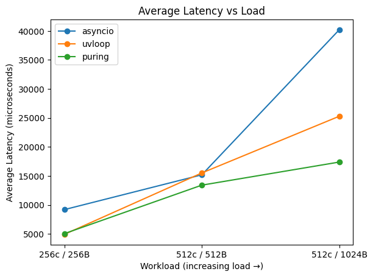

# Puring: High-Performance io_uring wrapper for Python

## Why Puring?
* **True Async File I/O:** Unlike epoll-based `asyncio` and `uvloop`, `puring` is based on io_uring, which provides real async I/O without thread pools for files \
<small> For full explanation, go [here](docs/uring/URING.md) </small>
* **Seamless Integration:** Designed to work as a plug-in for the standard `asyncio` event loop.
* **Low Overhead:** C-implemented request registry with $O(1)$ lookup.
* **Simple Architecture:** Simple layered architecture that makes it easy to understand of what's going on.
* **Full io_uring support** In future we'll implement all io_uring features.
* **C-Python API** Implemented using CPython C-API for minimal overhead and full control over memory and GIL behavior.

## Quick Example:
### Files:
```python
async def main():
    loop = puring.uring(registry_size=8)

    loop.add_reader()
    fd = await loop.open(path='testfile.txt')

    data = b'Hello, puring!\n'
    await loop.write(fd, data=data)
    await loop.read(fd=fd)

    await  loop.close(fd=fd)

    loop.close_loop()

asyncio.run(main())
```

### Sockets:
```python
HOST = "127.0.0.1"
PORT = 9000
PAYLOAD = b"hello"

async def main():
    loop = puring.uring()
    sock = await loop.tcp_socket()

    await sock.connect(HOST, PORT)
    await sock.send(PAYLOAD)
    data = await sock.recv()
    print("received:", data)
    await sock.close()
    loop.close_loop()

asyncio.run(main())
```

## Comparison
| Feature             | asyncio      | uvloop       | puring   |
| ------------------- | ------------ | ------------ | -------- |
| Async files         | ❌ threadpool | ❌ threadpool | ✅ native |
| Syscalls            | many         | many         | minimal  |
| Kernel batching     | ❌            | ❌            | ✅        |
| Zero-copy potential | ❌            | ❌            | ✅        |


## Quick Install
#### Warning! Linux only
> git clone git@github.com:AivazianArtur/puring.git \
> cd puring \
> make install

## Architecture
### Why Python needs it
It brings proactor pattern to Python in Linux, that:
* Allows implementation of async file I/O operations. 
* Enables designs compatible with upcoming no-GIL Python efforts.

### Current State
* Core C-engine for Ring management.
* Registry-based request tracking to connect futures with their result from CQE.
* Python C-API bridge for `asyncio.Future` resolution.
* Basic file usage. Brings true Async I/O.
* Basic socket usage.

### Goal
* Progressive coverage of io_uring features.
### How it works
To read about implementation details, go to [architecture page](docs/ARCHITECTURE.md)


## Benchmarks
On simple file benchmarks, `Puring` is showing that even in pre-alpha mode and with many features to come, it is already provide truly async file ops 2x-faster than other Python solutions. \
For ping-pong benchmark of sockets, puring now shows results close or event better than `uvloop`. It is proof of concept.

### File Results:


### Sockets Results:



To learn more, go to [benchmarks documentation](docs/BENCHMARK.md)


## Contributing
To start contribute, go to our [contributing guideline](docs/guidelines/CONTRIBUTING.md)

We are looking for help with:
1. Testing on different Linux Distros/Kernels.
2. Sharing experience in memory management, libraries architecture and many other things
3. Write tests and benchmarks \
And many more, see our [roadmap](docs/ROADMAP.md)

## Using
### Developer
To install, go to [installation page](docs/guidelines/INSTALLATION.md) \
To start contribute, go to [developer guideline](docs/guidelines/DEVELOPING.md) and [contribution guideline](docs/guidelines/CONTRIBUTING.md)

### User
See how to use here - [usage guide](docs/USAGE.md)


## Roadmap
See [here](docs/ROADMAP.md)
