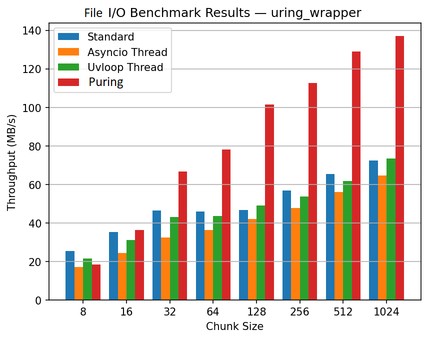
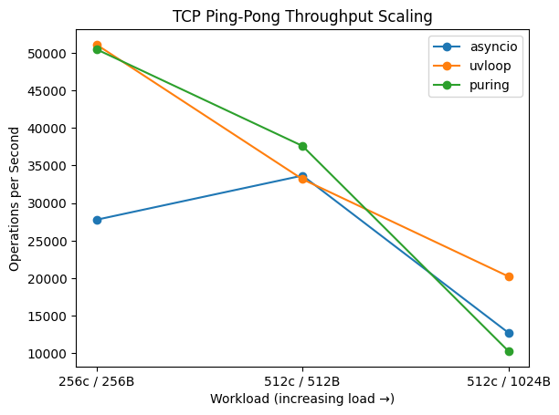
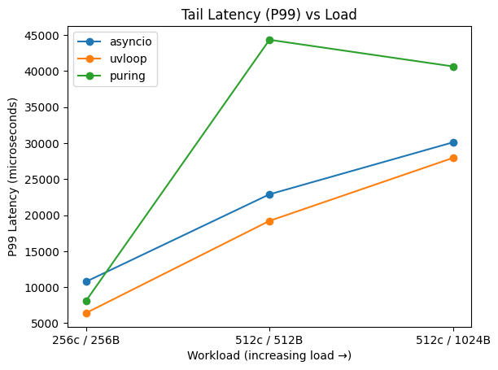

# Benchmarks

> [!IMPORTANT]
> **Puring** is currently in **Pre-Alpha**. These benchmarks represent the "floor" of its performance. \
> Advanced io_uring optimizations such as SQPOLL, fixed buffers, and zero-copy networking are not yet enabled.

## Test Environment
| Component | Value                          |
| --------- |--------------------------------|
| CPU       | Intel Core i7-6700HQ @ 2.6 GHz |
| RAM       | 32 GB                          |
| OS        | Fedora Linux 43 Workstation    |
| Python    | CPython                        |
| Runtime   | Pre-Alpha                      |

### All current benchmarks are inside `/docs/benchmark/`

## 1. File I/O Performance (Sequential Write)
This benchmark compares throughput when writing files of various sizes using different strategies.

| Chunk Size | Chunk Size (KiB) | Standard (MB/s) | Asyncio Thread (MB/s) | Uvloop Thread (MB/s) | **Puring (io_uring) Seq (MB/s)** |
|:--- |:--- |:--- |:--- |:--- |:--- |
| 1048576 | 1024 | 72.30 | 64.75 | 73.58 | **137.02** |
| 524288 | 512 | 65.38 | 56.00 | 61.89 | **128.94** |
| 262144 | 256 | 56.98 | 47.85 | 53.70 | **112.57** |
| 131072 | 128 | 46.69 | 41.96 | 49.11 | **101.51** |
| 65536 | 64 | 45.97 | 36.26 | 43.65 | **78.05** |
| 32768 | 32 | 46.60 | 32.54 | 43.00 | **66.72** |
| 16384 | 16 | 35.24 | 24.44 | 31.24 | **36.25** |
| 8192 | 8 | 25.36 | 17.07 | 21.55 | **18.37** |

---

### Observations

For large write sizes (≥128 KiB), io_uring achieves ~2× higher throughput compared to traditional thread-pool based approaches.

Removing ThreadPoolExecutor eliminates context switching overhead, which becomes a bottleneck in asyncio and uvloop.

Performance converges at very small chunk sizes, where syscall overhead dominates.

## 2. Networking Performance (TCP Ping-Pong)
This benchmark measures high-frequency socket operations using a TCP echo ping-pong pattern.

Each client sends a message and waits for the response before sending the next one.

#### Metrics collected:
- Throughput (ops/sec)
- Average latency
- Tail latency (P99)

## Workload Definitions

| Workload     | Connections | Messages | Message Size |
| ------------ | ----------- | -------- | ------------ |
| 256c / 256B  | 256         | 5000     | 256 B        |
| 512c / 512B  | 512         | 10000    | 512 B        |
| 512c / 1024B | 512         | 15000    | 1024 B       |

------------------------------------------------------------------------

## Throughput (Ops/sec)

------------------------------------------------------------------------

## Average Latency

------------------------------------------------------------------------

## P99 Tail Latency

------------------------------------------------------------------------

## Raw Results

### Workload: 256 connections / 256B messages

| Runtime | Ops/sec | Avg μs | P50 μs | P99 μs |
| ------- | ------- | ------ | ------ | ------ |
| asyncio | 27,783  | 9,203  | 9,112  | 10,762 |
| uvloop  | 51,102  | 4,938  | 4,873  | 6,412  |
| puring  | 50,478  | 5,066  | 4,839  | 8,104  |

### Workload: 512 connections / 512B messages

| Runtime | Ops/sec    | Avg μs | P50 μs | P99 μs |
| ------- | ---------- | ------ | ------ | ------ |
| asyncio | 33,660     | 15,200 | 14,990 | 22,896 |
| uvloop  | 33,180     | 15,521 | 15,378 | 19,208 |
| puring  | **37,609** | 13,420 | 134    | 44,354 |

### Workload: 512 connections / 1024B messages

| Runtime | Ops/sec    | Avg μs | P50 μs | P99 μs |
| ------- | ---------- | ------ | ------ | ------ |
| asyncio | 12,732     | 40,203 | 24,570 | 30,112 |
| uvloop  | **20,236** | 25,294 | 25,176 | 27,948 |
| puring  | 10,290     | 17,397 | 34     | 40,656 |

------------------------------------------------------------------------

## Observations
- Under light workloads, `puring` performs close to `uvloop` throughput.
- Under **higher concurrency**, `puring` reaches the **highest throughput** in the 512B workload.
- `asyncio` shows significantly **lower throughput and higher latency** in all tests.
- Tail latency under heavier loads varies and will be investigated with full latency distribution analysis.

# Architectural Notes
Puring leverages the `io_uring` interface to improve asynchronous I/O efficiency.

## Key advantages:
### Shared Kernel Rings
Submission (SQ) and completion (CQ) rings are stored in shared memory, reducing syscall overhead.

### Proactor Execution Model
Unlike `epoll`, `io_uring` performs the actual I/O operation inside the kernel and notifies the application only when the operation completes.

### Reduced Context Switching
By avoiding thread pools, Puring eliminates scheduling overhead common in Python async file I/O.

# Architectural Notes
## Future Optimizations
**These benchmarks do not yet include several important io_uring optimizations:**
- SQPOLL
- Registered buffers
- Zero-copy networking
- Batched submissions
- Multishot recv/send

Performance is expected to improve as these features are implemented.
#
